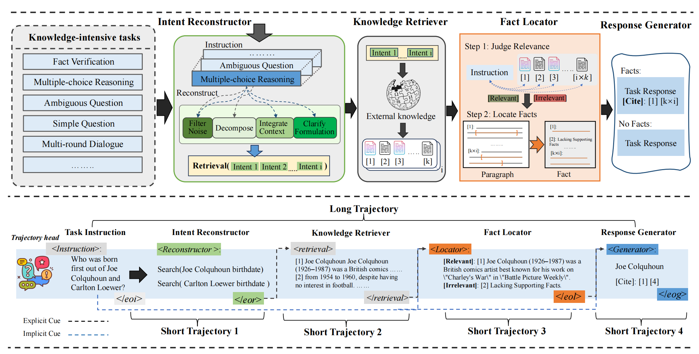

# 📚️ Synergistic Multi-Agent Framework with Trajectory Learning for Knowledge-Intensive Tasks [[Paper]](https://arxiv.org/abs/2407.09893)

*Shengbin Yue, Siyuan Wang, Wei Chen, Xuanjing Huang, and Zhongyu Wei**

**SMART**, an innovative multi-agent co-framework to internalize complex trajectories in knowledge-intensive tasks by Long- and Short-Trajectory Learning. This general paradigm can be expanded to other complex tasks, empowering arbitrary multi-agent
frameworks to internalize tailored trajectories.



In this repository, we will release:

- The constructed Trajectory Dataset.
- SMART 7B model.
- Training scripts utilized to train SMART.
- Evaluation datasets and scripts used in our paper.


## Content 
1. [Installation](#installation)
2. [Setting Retriever](#setting-knowledge-retriever)
3. [Data Construction](#data-construction)
4. [Training](#training)
5. [Evaluation](#evaluation)
6. [Citation](#citation)


## Installation

1. Clone this repository

```
git clone https://github.com/yueshengbin/SMART.git
cd SMART
```
2. Install packages

```
conda create -n smart python=3.10 -y
conda activate smart
pip install --upgrade pip
pip install -r requirements.txt
```

Please use the latest version of `vllm`. 
## Setting Knowledge Retriever
The Knowledge Retriever is driven by [Contriever-MSMARCO](https://huggingface.co/facebook/contriever-msmarco) and access knowledge documents from the official Wikipedia corpus.

### Download wikipedia data
Download preprocessed passage data and generated passages. 
```
cd multi_agent
wget https://dl.fbaipublicfiles.com/dpr/wikipedia_split/psgs_w100.tsv.gz
wget https://dl.fbaipublicfiles.com/contriever/embeddings/contriever-msmarco/wikipedia_embeddings.tar
```

### Run retriever
You can run document retrieval by running the command below. 

```
cd multi_agent
python passage_retrieval.py \
    --model_name_or_path facebook/contriever-msmarco --passages psgs_w100.tsv \
    --passages_embeddings "wikipedia_embeddings/*" \
    --data YOUR_INPUT_FILE  \
    --output_dir YOUR_OUTPUT_FILE \
    --n_docs 25
```
Your input file should be either a `json` or `jsonl`. In
each instance, `instruction`is as a query for retrieval. 

### Generate embeddings for your own data

You can generate embeddings for your own data by running the following command.

```
cd retrieval_lm
for i in {0..3}; do
  export CUDA_VISIBLE_DEVICES=${i}
  python generate_passage_embeddings.py  --model_name_or_path facebook/contriever-msmarco \
  --output_dir YOUR_OUTPUT_DIR \
  --passages YOUR_PASSAGE_DATA --shard_id ${i}  --num_shards 4 > ./log/nohup.my_embeddings.${i} 2>&1 &
```


## Data Construction

**Trajectory Dataset Construction** contains two components: the long-trajectory subset and the short-trajectory subset. The data construction follows two distinct principles:
- Collect long-trajectory data
- Collect short-trajectory data

The code to create Trajectory Dataset is under [data_creation](data_creation). See the instructions at [README.md](data_creation/README.md). 

🚀 You can download our dataset at [HuggingFace]()


## Training
Long Short-Trajectory Learning is optimized our multi-agent framework, which consists of two stages, Short Trajectory and Long
Trajectory Learning. The training code is under [multi_agent](multi_agent).

### Short Trajectory Learning
**Stage 1** is use short-trajectory subset to train the pre-train LLM.
```
bash script_short_learning.sh
```
### Long Trajectory Learning
**Stage 2** is use long-trajectory subset to train the model after short trajectory learning.
```
bash script_long_learning.sh
```

if use Lora by setting `--use_lora`, plaese merge the lora weight with original model.  

```
python merge_lora --base BASE_MODEL_NAME \
--target OUTPUT \
--lora LORA_NAME
```


## Evaluation 

Please see [eval](eval) for details about the evaluation datasets and evaluation scripts.

To improve the inference efficiency, we use a static retrieval approach, i.e., we first retrieve all documents and then continue to inference.


## Citation

If you find our work useful, please cite our paper:
```
@article{yue2024synergistic,
  title={Synergistic Multi-Agent Framework with Trajectory Learning for Knowledge-Intensive Tasks},
  author={Yue, Shengbin and Wang, Siyuan and Chen, Wei and Huang, Xuanjing and Wei, Zhongyu},
  journal={arXiv preprint arXiv:2407.09893},
  year={2024}
}
```
